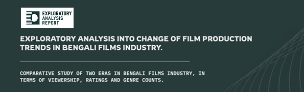
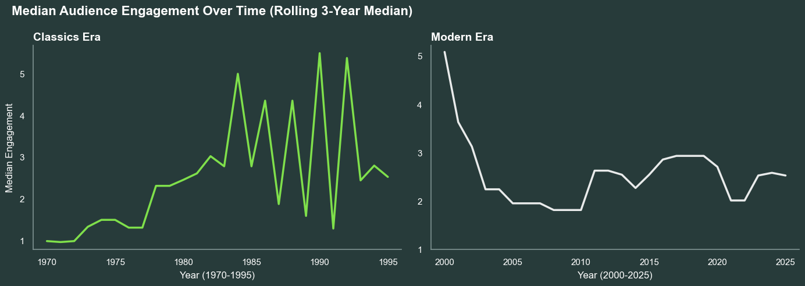
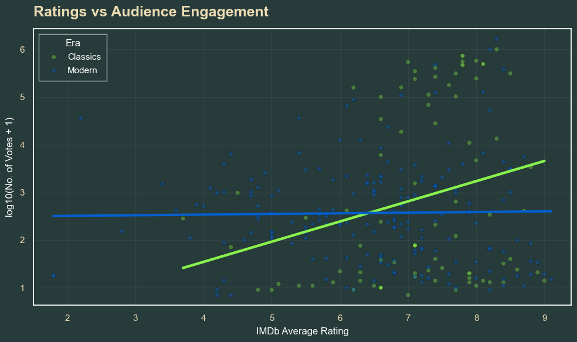
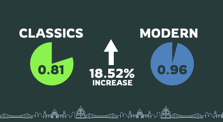

# Bengali Film Industry: Structural Change Analysis

> How did Bengali cinema shift from building enduring classics to fragmenting audience attention across dozens of forgettable films?

<div align="center">
  
</div>

A data-driven exploratory analysis of structural transformation in Bengali cinema across two eras: **classics (1960s–1990s)** vs **modern (2000s–2020s)**.

[](https://www.python.org/)
[](https://pandas.pydata.org/)
[](https://github.com)
[](LICENSE)


---

## 🎯 The Question

**Is the observed decline in Bengali film quality, or has the system for distributing cultural attention fundamentally shifted?**

This project moves beyond subjective "films aren't as good anymore" debates and tests whether measurable engagement patterns, genre diversity, and the quality-reach relationship have changed.

---

## Key Findings

<table>
<tr>
<td width="50%" align="center">

### Quality No Longer Predicts Reach

**Classics Era:** r = **0.271**  
**Modern Era:** r = **−0.048**

A complete collapse in the relationship between perceived quality and audience engagement.

</td>
<td width="50%" align="center">

### Attention Is Hyper-Concentrated

**Gini Coefficient**  
Classics: **0.81** → Modern: **0.96**  
**+18.52% increase**

Winner-takes-all visibility despite increased production diversity.

</td>
</tr>
</table>

| Metric | Classics | Modern | Change | What It Means |
|--------|----------|--------|--------|---------------|
| **Engagement Peaks** | Recurring cultural moments | Flat, fragmented | ↓ Flatter | Films don't accumulate enduring impact |
| **Genre Diversity** | Concentrated (Shannon: 2.86) | Diversified (Shannon: 3.24) | ↑ +13% | More variety, but less sustained attention per film |
| **Runtime Variability** | Standardized | High variance | ↑ Variable | Breakdown of traditional theatrical formats |
| **Production Volume** | Stable | Stable | → Flat | Change isn't *what* films are made, it's *how* attention flows |

---

### 📊 Visual Evidence
 
**1. Engagement Trends: The Shape Shift**
 

 
*Left (classics era): Recurring peaks—films accumulate engagement over time, creating cultural moments. Right (modern era): Flatter baseline—most films plateau quickly regardless of when released.*
 
---
 
**2. Quality No Longer Predicts Reach**
 

 
*Green line (classics): Higher IMDb ratings = more votes. Clean relationship. Blue line (modern): Nearly flat—a 9-rated film gets the same engagement as a 4-rated film. Quality is decoupled from visibility.*
 
---
 
**3. Attention Concentration: The Winner-Takes-All Effect**
 

 
*Gini coefficient measures inequality in attention distribution. 0.81 → 0.96 means modern audiences concentrate their votes on a shrinking number of films, even as production diversifies.*
 
---

## The Pattern

```
CLASSICS ERA                          MODERN ERA
Long engagement curves                Short, sharp peaks
Canonical films accumulate votes      Most films plateau quickly
Quality → Cultural visibility         Quality ≠ Visibility
Tight producer-audience feedback      Fragmented, algorithm-driven distribution
```

**The main shift:** Production diversity increased, but audience engagement became more concentrated and unpredictable.

---

## Repository Structure

```
├── datasets/                      # Raw IMDb datasets (gzipped)
│   ├── title.basics.gz
│   ├── title.ratings.gz
│   └── title.akas.gz
├── data_preprocessed/             # Cleaned, filtered Bengali films data
├── data_processed/                # Feature-engineered data (ready for analysis)
├── data_analysed/                 # Final outputs (aggregates, metrics, correlations)
├── report/
│   └── Bengali_Films_Ratings_Engagement_Analysis.pdf
├── requirements.txt
└── README.md
```

---

## Quick Start

### Requirements

| Package | Version | Purpose |
|---------|---------|---------|
| `python` | 3.13.2 | Core runtime |
| `pandas` | 3.0.2 | Data manipulation |
| `numpy` | 2.4.4 | Numerical computation |
| `scipy` | 1.17.1 | Statistical analysis |
| `matplotlib` | 3.10.9 | Visualization |
| `seaborn` | 0.13.2 | Statistical plots |
| `jupyter` | 7.0+ | Notebook environment |

**Install all dependencies:**
```bash
pip install -r requirements.txt
```

### Run the Analysis

```bash
# 1. Start Jupyter
jupyter notebook

# 2. Run in order:
# - data_preprocessed.ipynb
# - data_processed.ipynb
# - data_analysed.ipynb
```

---

## Methodology

**Data Source:** IMDb public datasets (title.basics, title.ratings, title.akas)

**Key Metrics:**
- **Engagement Proxy:** Log-transformed IMDb vote counts (captures audience attention)
- **Quality Signal:** IMDb average ratings (perceived quality)
- **Correlation Analysis:** Spearman rank correlation (handles non-linear, heavy-tailed distributions)
- **Inequality Measure:** Gini coefficient (attention concentration across films)
- **Diversity Measure:** Shannon entropy (genre concentration)
- **Trend Analysis:** Rolling 3-year median (smooths short-term volatility)

**Era Split:**
- **Classics:** 1960–1999
- **Modern:** 2000–2025

See [full report](report/Bengali_Films_Ratings_Engagement_Analysis.pdf) for detailed visualizations and deeper analysis.

---

## Limitations

- **IMDb Tagging:** Language/regional classification is imperfect—some Bengali films may be miscoded or excluded
- **Engagement Proxy:** Vote counts don't capture box office, TV viewership, or long-term cultural memory
- **Sample Bias:** IMDb users represent digitally active audiences; patterns may not reflect broader demographics
- **Causality:** Analysis identifies correlations and structural patterns, not causal mechanisms

**Despite these limitations**, the dataset reveals clear, consistent patterns in how attention distribution and quality-reach alignment have shifted across eras.

---

## What's Inside the Report

- **Long-Term Cultural Engagement Trends:** How median engagement evolved over time
- **The Long-Tail Effect:** Why modern films exhibit more centralized, less distributed attention
- **Quality-Reach Decoupling:** Visual and statistical evidence that ratings no longer predict reach
- **Genre Composition Analysis:** Shifts in narrative types and their engagement patterns
- **Attention Inequality Measurement:** Quantifying the concentration of visibility
- **Full Data Pre-processing Pipeline:** Reproducible methodology for filtering Bengali-language cinema from IMDb

---

## Future Iterations & Collaboration Needs

This analysis identifies the *what* and *how* of attention distribution shifts. Next steps require:

**1. Genre-Specific Underutilization Measurement**
- Current analysis shows drama dominance persists, but engagement inequality suggests certain genres are systematically invisible despite production diversity
- **Next:** Quantify engagement gaps between top-tier and low-visibility films *by genre*
- Can we identify genres with high production but low cultural penetration?

**2. Feasibility Study: Expanding Underutilized Genres**
- If we identify which genres are underperforming in audience reach despite critical potential, can we model strategies to increase visibility?
- Would require: targeted data on genre audience demographics, release strategy analysis, marketing spend data
- Output: A roadmap for which genres might benefit from distribution/marketing intervention

**3. Financial Performance Integration**
- **Current limitation:** IMDb votes approximate engagement but don't capture revenue, production budgets, or ROI
- **What's missing:** Box office data, production costs, OTT platform performance, TV/streaming viewership
- **Impact:** Could we correlate genre underutilization with financial performance? Are invisible films also unprofitable, or are they undermarketed hits?

**Collaboration opportunities:**
- Access to box office databases (Indian film industry data is fragmented—this is a real challenge)
- Streaming platform engagement metrics (YouTube views, OTT platform watch data for Bengali content)
- Production & distribution cost data
- Audience demographic/regional data beyond IMDb's digitally-active subset

If you have access to any of these datasets or want to extend this analysis, open an issue.

---

## Citation

A.R. Patwari (2026). *Exploratory Analysis into Change of Film Production Trends in Bengali Films Industry*. Self-published independent analysis.

---

**Questions?** Open an issue or reach out. Code and full analysis notebooks are above.
